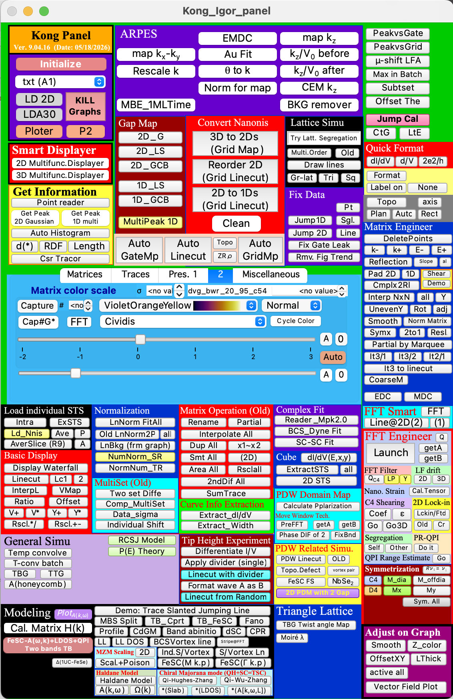

# 𝑲𝑶𝑵𝑮 Panel

𝑲𝑶𝑵𝑮 Panel (KP) is an Igor Pro source package for scanning tunneling microscopy (STM/STS) data processing, interactive visualization, spectral analysis, FFT/QPI workflows, lattice/strain analysis, and simple model simulation. It was developed by [Lingyuan Kong](https://www.westlake.edu.cn/faculty/lingyuan-kong.html) as a working research panel: the goal is to keep the everyday analysis path inside one Igor environment, from loading raw Nanonis data to plotting maps, extracting spectra, fitting linecuts, running simulations, and formatting final figures.



Main 𝑲𝑶𝑵𝑮 Panel interface image, packaged for the GitHub description and linked to the button/procedure map in `docs/PANEL_GUIDE.html`.

## Documentation

Start with these two guides when browsing the package on GitHub:

- [Panel Guide](docs/PANEL_GUIDE.md): visual map of the main panel, each button/control, the action procedure it calls, and the related internal panels.
- [Function Index](docs/FUNCTION_INDEX.md): workflow-organized index of the `Function`, `Proc`, `Window`, `Macro`, and `Menu` definitions parsed from `src/*.ipf`.

The repository also includes interactive HTML manuals with search and navigation. After GitHub Pages is enabled for this repository, these links open the rendered manuals directly in a browser:

- [Interactive documentation site](https://lkong92.github.io/Kong_Panel/)
- [Function Book HTML](https://lkong92.github.io/Kong_Panel/FUNCTION_BOOK.html)
- [Panel Guide HTML](https://lkong92.github.io/Kong_Panel/PANEL_GUIDE.html)
- [Package Summary HTML](https://lkong92.github.io/Kong_Panel/SUMMARY.html)

GitHub shows the Markdown files directly in the repository browser. The GitHub Pages links above are the preferred way to use the interactive HTML versions from the web.

Selected KP modules and related standalone tools have also been posted separately on WaveMetrics:

- Author page: [https://www.wavemetrics.com/user/lykong](https://www.wavemetrics.com/user/lykong)
- Related standalone posts include the interactive 2D/3D wave displayers, Haldane model, Qi-Wu-Zhang model, Qi-Hughes-Zhang model, multi-order simulator, and twisted honeycomb lattice simulator.

## Development Background

KP has been developed as a personal research workflow since 2016-04-15, with the surviving update log beginning on 2021-09-17. The package grew gradually from everyday STM/STS, ARPES, FFT/Fourier-transform analysis, lattice-analysis, and modeling needs rather than from a single one-time software design pass. Parts of the early code base grew from a general ARPES Igor template written by [Pierre Richard](https://scholar.google.com/citations?user=vJ47zG8AAAAJ) and [Hong Ding](https://tdli.sjtu.edu.cn/en/people/41168/hong-ding).

## Demonstration and Citation

Many STM/STS workflows for real-space image analysis, Fourier-transform analysis, and spectroscopic-map processing in KP were developed while processing data for [Kong et al., "Cooper-pair density modulation state in an iron-based superconductor," Nature 640, 55-61 (2025)](https://www.nature.com/articles/s41586-025-08703-x). This GitHub package provides the Igor analysis source code used for data analysis in that Nature work; the source data themselves are published with the article. Together, the paper and its associated source data provide a scientific demonstration of the type of real-space STM analysis that can be realized with 𝑲𝑶𝑵𝑮 Panel.

If KP is useful for your work, citation of that Nature paper is appreciated:

```text
Kong, L. et al. Cooper-pair density modulation state in an iron-based superconductor.
Nature 640, 55-61 (2025). https://doi.org/10.1038/s41586-025-08703-x
```

## Release Status

- Version prepared for GitHub: `9.04.16`, dated `2026-05-18`.
- Recommended Igor Pro version: Igor Pro 9 series; this package was prepared from the Igor 9.04 KP line.
- KP-local Nanonis loading code is now in `src/KP_NanonisLoaders.ipf`.
- Custom color-table waves are loaded from `src/KP_NewColorTables.itx` when the panel opens.
- `src/Kong_Igor_panel.ipf` is self-contained: opening that panel source also includes all of the action-procedure files used by its controls.

## Quick Start

𝑲𝑶𝑵𝑮 Panel is distributed as an Igor Pro 9 source package. The loader file, `src/Load_KongPanel.ipf`, includes the main panel recreation file, which then includes the analysis, display, fitting, simulation, and utility procedure files used by the panel. When the procedures compile, Igor adds a `Kong Panel` menu item; opening the panel also loads the custom color-table waves from `KP_NewColorTables.itx` into `root:Packages:NewColortable`.

## Prerequisite: Install Igor Pro 9

KP is prepared and tested with the Igor Pro 9 series. Install Igor Pro 9 from WaveMetrics before using this package:

- Current and earlier Igor installers: [WaveMetrics current software versions](https://www.wavemetrics.com/support/versions)
- Igor Pro 9 download and activation notes: [WaveMetrics Igor Pro 9 downloads](https://www.wavemetrics.com/order/order_downloads.htm)
- Pricing and license options: [WaveMetrics Igor Pro pricing](https://www.wavemetrics.com/order/order_prices.htm)

Igor Pro is commercial software. WaveMetrics provides a fully functional 30-day evaluation period; after that, an unlicensed installation enters limited-functionality mode. WaveMetrics offers Standard, Academic, Student, and multi-user/coursework license options. As checked on 2026-05-19, WaveMetrics lists Igor Pro 10 as Windows-only, while Igor Pro 9 provides macOS and Windows installers; KP is tested here against Igor Pro 9.

## Installation: User Procedures Method

This is the recommended setup if you want KP available from any clean Igor experiment.

```igorpro
#include "Load_KongPanel"
```

1. Copy the entire `src/` folder into Igor Pro's `User Procedures` folder. Keeping the files together in a folder named `KongPanel` is recommended.
   - On macOS this is typically under `Documents/WaveMetrics/Igor Pro 9 User Files/User Procedures/`.
   - In Igor, use `Help -> Show Igor Pro User Files` to locate the correct user-files folder.
2. Keep `KP_NewColorTables.itx` with the `.ipf` files, preferably inside the same `KongPanel` or `src` folder. This file contains the 47 custom color-table waves used by KP.
3. Open Igor Pro 9 with a clean experiment.
4. Open the built-in procedure window via `Windows -> Procedure Windows -> Procedure Window`, or create a new procedure window via `Windows -> New -> Procedure`.
5. Add this include line at the far left edge of the procedure window:

```igorpro
#include "Load_KongPanel"
```

6. Compile procedures by clicking `Compile` in the procedure window, or by using Igor's procedure compile command.
7. Open the panel from `Kong Panel -> Open Kong Panel`, or run:

```igorpro
Kong_Igor_panel()
```

You can also explicitly open the loader file using `File -> Open File -> Procedure...` and select `src/Load_KongPanel.ipf`. Igor's official documentation recommends `#include` for shared procedure packages; quoted includes search the Igor Pro User Files `User Procedures` folder and its subfolders.

## Alternative: Per-Experiment PXP Template

If you prefer each dataset to live in its own self-contained Igor experiment, you can make a KP template `.pxp` once and then copy that template into each new data folder.

1. Start from a clean Igor Pro 9 experiment.
2. Load and compile KP using the User Procedures method above, or explicitly open the KP procedure files from the local `src/` folder.
3. Run `Kong_Igor_panel()` once so the panel opens and the 47 color-table waves are loaded.
4. In Igor's command line, run:

```igorpro
AdoptFiles/A
```

5. Save the experiment as something like `KongPanel_Template.pxp`.
6. For a new experiment, create a fresh data folder, copy `KongPanel_Template.pxp` into that folder, open it, and load/analyze the data there. This keeps each project as an independent `.pxp` and does not require the daily analysis session to find KP files in `User Procedures`.

Avoid loading this source package on top of another KP experiment that already contains KP procedure pages with the same function names. A mixed session with duplicate KP procedure pages can produce duplicate-definition errors.

When preparing a GitHub release or ZIP archive, include both `src/KP_ColorTables.ipf` and `src/KP_NewColorTables.itx`. Without the `.itx` file, the source package can still compile, but popups and graph-formatting functions that reference `root:Packages:NewColortable:*` will not have the custom color waves available.

## What 𝑲𝑶𝑵𝑮 Panel Does

KP is broad by design. The panel is arranged as a collection of compact work areas rather than a single linear wizard. The following map summarizes the main functional groups visible in the panel and the corresponding IPF modules.

### Nanonis, STM, and STS Data Loading

KP provides loaders and converters for common Nanonis-style STM/STS workflows:

- Auto-load Nanonis `.3ds` linecuts and grid maps.
- Auto-load `.sxm` and `.nsp` topography files.
- Convert grid spectra into 2D maps, 2D linecuts, and 1D spectra.
- Reorder 2D grid linecuts and slice 3D data into 1D/2D outputs.
- Build gate maps and grid maps from automatically loaded Nanonis folders.
- Generate Z maps, R maps, rho maps, and L maps from symmetric energy data.
- Extract topography after loading `.sxm/.nsp` files.

The KP-local Nanonis loader in `KP_NanonisLoaders.ipf` supports the panel's `.3ds`, `.sxm`, and `.nsp` workflows. It was rewritten from the small subset of [Kohsaka Macro (KM)](http://www2.riken.jp/lab/magmatlab/kohsaka/km/cmdlist.html) loading behavior that KP used; KM was written by [Yuhki Kohsaka](https://kdb.iimc.kyoto-u.ac.jp/profile/ja.436d1ff61062e548.html). No full KM package management or unrelated KM UI behavior is included.

Main files:

- `src/KP_NanonisLoaders.ipf`
- `src/UNISOKU3dscutextract.ipf`
- `src/Miscellaneous_Codes.ipf`

### Smart Display and Figure Formatting

KP includes fast display tools for 1D, 2D, and 3D waves:

- Interactive 2D wave displayer with color-table selection, normal/inverse color modes, auto range, sigma-style color scaling, graph capture, and quick recoloring.
- Interactive 3D wave viewer for slicing, plotting, and inspecting 3D datasets.
- Waterfall plots, linecut display, voltage maps, ratio maps, and multi-trace copy/cleanup utilities.
- Z-color plotting, trace offsets, line thickness control, active-trace operations, and vector-field plotting.
- Quick formatting buttons for `dI/dV`, distance-vs-voltage, conductance unit labels, topography maps, axis arrows, plan/auto/rectangle figure styles, and label-on/label-off figure modes.
- RGB image conversion helpers, graph/table cleanup, and graph transfer utilities.

Some of these display tools are also available as standalone WaveMetrics posts on the author page.

Main files:

- `src/SmartDisplay.ipf`
- `src/Smart_3D_Viewer_New.ipf`
- `src/transfergraph.ipf`
- `src/Miscellaneous_Codes.ipf`

### FFT, QPI, Lock-In, Drift, and Symmetrization

The FFT and QPI area is one of the largest parts of KP:

- 2D FFT for real-space STM images, including interpolation, padding, selected-region FFT, and real/complex conversion.
- 1D FFT along linecuts and linecut-filter workflows.
- FFT filtering, low-pass filtering, fixed-width Fourier filtering, and filter-width controls.
- Q-vector extraction with `Get A/Get B/Get Q` style marker workflows.
- Moving-window phase extraction and phase-difference mapping.
- 2D lock-in plus Fourier-filter workflows.
- Lawler-Fujita drift correction for 2D and 3D data.
- Nanoscale strain-tensor calculation from displacement fields.
- C4, D4, mirror, diagonal, off-diagonal, x, and y symmetrization utilities.
- Phase-referenced QPI and QPI range estimation.

Main files:

- `src/FFT.ipf`
- `src/Lawler-Fujita Drift Correction.ipf`
- `src/Map_the_phase_difference_between_two_image.ipf`
- `src/Symmetrization.ipf`
- `src/PR_QPI.ipf`
- `src/Shear Correction for C4.ipf`

### Matrix, Cube, and General Data Operations

KP contains many Igor wave operations that are useful when repeatedly cleaning and reshaping STM/ARPES matrices:

- Delete points, crop by energy or momentum limits, extract marquee regions, and cut NaN edges.
- Interpolate 2D data to arbitrary size, interpolate only along y, and handle uneven y-axis data.
- Rotate, reflect, shear, pad, smooth, normalize, rescale, and coarse-grain matrices.
- Convert complex waves to real/magnitude outputs.
- Convert 3D cubes to linecuts, 2D slices, or summed maps.
- Duplicate, rename, partially select, rescale, smooth, area-normalize, second-differentiate, and sum batches of waves.
- File-to-wave and wave-to-file helper routines.

Main files:

- `src/MatrixCalculation.ipf`
- `src/FFT.ipf`
- `src/Miscellaneous_Codes.ipf`
- `src/Procedure.ipf`

### Spectroscopy, Gap Maps, and Tip-Height Experiments

KP includes STS analysis routines used for maps, linecuts, and individual spectra:

- 1D and 2D gap extraction.
- Gaussian and GCB-style gap-map workflows.
- Multi-peak 1D linecut fitting.
- 2D Gaussian peak finding and 1D multi-peak extraction.
- BCS/Dynes and SC-SC fitting utilities.
- Load and average individual STS spectra.
- Normalize spectra and linecuts using fitted backgrounds, numerical references, and waterfall-style traces.
- Convert `I/V` to `dI/dV` by differentiation.
- Apply voltage-divider corrections to single spectra, regular linecuts, and randomly sampled linecuts.
- Format one wave according to another wave/template.

Main files:

- `src/MultipeakforLinecut.ipf`
- `src/General_Simu.ipf`
- `src/Miscellaneous_Codes.ipf`
- `src/UNISOKU3dscutextract.ipf`

### ARPES and Template Utilities

KP still carries a large ARPES/template section inherited from earlier Igor workflows:

- Load common ARPES text formats and plot EDC/MDC-style data.
- Build matrix and 3D matrix views from ARPES cuts.
- Convert angle to momentum and handle `kx-ky`, `kz`, and photon-energy maps.
- Rescale momentum, normalize map data, combine energy/momentum ranges, and build Fermi-surface images.
- Add Fermi-level markers, symmetrize EDC matrices, divide by Fermi functions, and keep positive/negative branches.
- Remove backgrounds, build equivalent waves, and handle Scienta/A1-style inputs.

Main file:

- `src/Pierre's Template.ipf`

### Lattice, Strain, Segregation, and Moire Tools

KP includes tools for real-space lattice work and moire analysis:

- Draw and append honeycomb, triangular, and square lattice overlays on topography.
- Fit lattice overlays using lattice constant, rotation, and offsets.
- Simulate honeycomb and triangular-lattice images.
- Calculate twisted bilayer/trilayer graphene lattice patterns.
- Estimate twist-angle maps and moire wavelengths.
- Perform lattice-segregation analysis.
- Calculate RDF/length statistics and cursor-based point information.
- Apply shear correction and C4 shear workflows.

Main files:

- `src/Triangle Lattice_Graphene_like.ipf`
- `src/Lattice Segregation.ipf`
- `src/General_Simu.ipf`
- `src/Shear Correction for C4.ipf`

### Model Simulation

KP contains model simulators and teaching/research calculations that can be launched from the panel:

- Haldane model, including `A(k, omega)` and Berry-curvature style outputs.
- Qi-Wu-Zhang model.
- Qi-Hughes-Zhang superconducting QAH/topological superconductor model, including slab, LDOS, and `A(k, omega, L)` utilities.
- FeSC tight-binding, FeSC `k.p`, QPI, LDOS, and Fermi-surface simulations.
- Majorana bound-state splitting, CdGM states, Landau-level DOS, vortex-line and superconducting vortex simulations.
- PDW, CDW, multi-order, vortex-pair, topological-defect, and 2D PDM simulations.
- Temperature convolution, batch temperature convolution, RCSJ model, and P(E) theory calculations.
- Global SI constants for command-line and modeling work: `q0`, `h`, `G0`, `muB`, `kB`, `eV`, `meV`, and `m0`.
- Matrix-Hamiltonian construction with complex/text Pauli matrices (`s0/sx/sy/sz`, `st0/stx/sty/stz`), tensor products (`mpc/mpn/mpt`), text matrix addition (`plust`), and automated Pauli-sequence builders (`automatrixT/automatrixC`).
- Band calculations and model-Hamiltonian demonstrations.

Main files:

- `src/Models.ipf`
- `src/ModelingTunneling.ipf`
- `src/General_Simu.ipf`

## Documentation

The `docs/` folder contains both release notes and generated code references.

- `docs/CHANGELOG.md`: polished GitHub-facing changelog.
- `docs/KP_update_log_20260518.md`: short update entry for the 2026-05-18 GitHub preparation.
- `docs/KP_update_log_original.rtf`: original update-log copy.
- `docs/KP_update_log_raw.txt`: plain-text conversion of the original log.
- `docs/code_inventory.md`: source extraction, include layout, and Nanonis loader notes.
- `docs/FUNCTION_BOOK.html`: color-coded function manual generated from all IPF files.
- `docs/FUNCTION_INDEX.md`: GitHub-readable Markdown function index, organized by workflow rather than by IPF file.
- `docs/assets/kong_panel_main.png`: GitHub-friendly main-panel image.
- `docs/PANEL_GUIDE.html`: main-panel image plus button-to-procedure guide.
- `docs/PANEL_GUIDE.md`: Markdown version of the panel guide.
- `docs/function_catalog.json`: machine-readable function catalog.
- `docs/panel_catalog.json`: machine-readable panel/control catalog.

## Function Book

The generated function manual covers every `Function`, `Proc`, `Window`, `Macro`, and `Menu` definition found in `src/*.ipf`.

Open this file in a browser for the best reading experience:

```text
docs/FUNCTION_BOOK.html
```

The HTML manual is styled to resemble Igor procedure-code structure: keywords are blue, function/procedure names are visually separated, signatures use a monospace font, and panel callback controls are marked in purple. It is organized by workflow and role, not by IPF file, while still showing source file and line for navigation. The current generated catalog contains `3203` entries from `25` IPF files.

For GitHub browsing, use:

```text
docs/FUNCTION_INDEX.md
```

For the main 𝑲𝑶𝑵𝑮 Panel layout, button map, and secondary/internal panel overview, use:

```text
docs/PANEL_GUIDE.html
```

## Repository Layout

- `src/Load_KongPanel.ipf`: recommended loader; compiles all KP sources and adds the `Kong Panel` menu.
- `src/Kong_Igor_panel.ipf`: self-contained panel entry; opening it includes all required action-procedure files.
- `src/KongPanel.ipf`: compatibility umbrella include.
- `src/KP_NanonisLoaders.ipf`: KP-local Nanonis `.3ds`, `.sxm`, and `.nsp` loader.
- `src/*.ipf`: KP analysis, display, simulation, fitting, formatting, and panel modules.
- `docs/`: changelog, update-log copies, code inventory, and function reference.
- `scripts/build_function_book.py`: regenerates the function book, function index, panel guide, and JSON catalogs.

## External Igor Procedure Dependencies

KP uses several standard WaveMetrics/Igor procedure files through Igor's include system:

- `Resize Controls`
- `Peak AutoFind`
- `Global Fit 2`

These files are not vendored into this repository. They should be available from Igor Pro/WaveMetrics procedure libraries or installed separately in the user's Igor procedure path.

## Attribution

KP was developed by [Lingyuan Kong](https://www.westlake.edu.cn/faculty/lingyuan-kong.html) for STM data analysis and model simulation workflows, with development beginning on 2016-04-15 according to the preserved [project log](docs/KP_update_log_raw.txt). This GitHub version was prepared with the help of [Codex](https://openai.com/codex/). Earlier parts of the package grew from a general ARPES Igor template by [Pierre Richard](https://scholar.google.com/citations?user=vJ47zG8AAAAJ) and [Hong Ding](https://tdli.sjtu.edu.cn/en/people/41168/hong-ding), with some signal-enhancement functions referring to [Peng Zhang](https://physics.nju.edu.cn/english/Research/ByDepartment/DeptofPhysics/20221205/i233704.html)'s [curvature-analysis macro](https://github.com/zhangpengphi/curvature).

## License

𝑲𝑶𝑵𝑮 Panel is released under the MIT License.

Copyright (c) 2026 Lingyuan Kong. See [LICENSE](LICENSE) for details.
